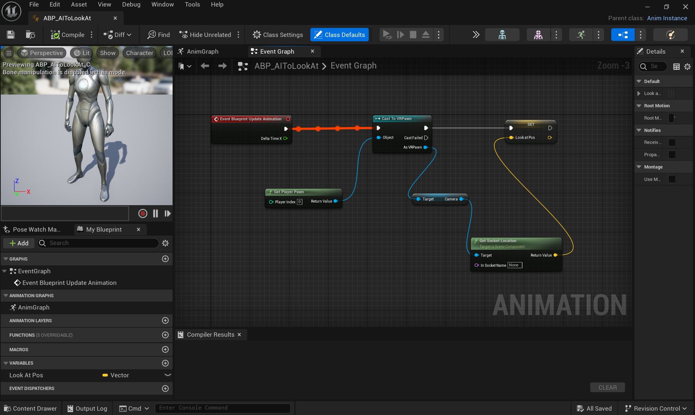
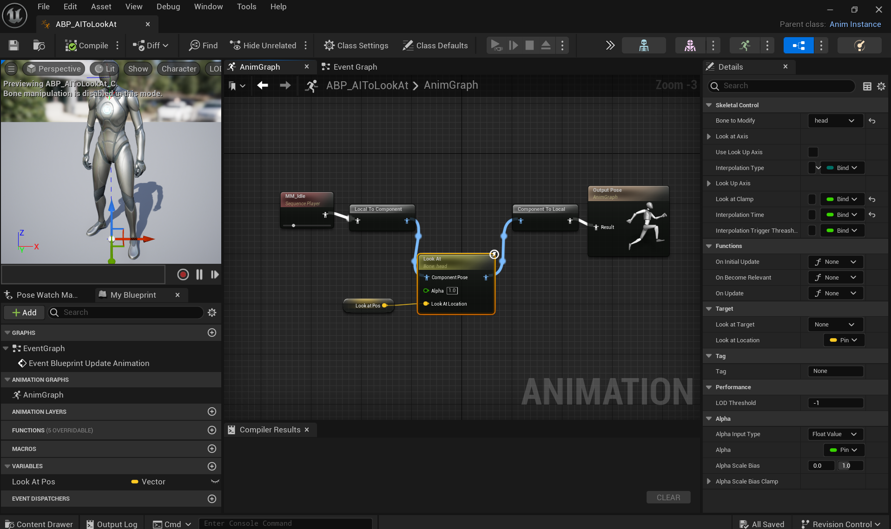

## How can you make a Metahuman look at the VR player? ##
   
In the current project, participants and the virtual character engage in social interactions. Eye contact is a significant aspect of social interactions. This repository will explain how to make a metahuman maintain eye contact with the player.
   
## Steps for creating a VR Character looking at the VR Player`s head: ##
  
1.	Create a new BP class under the Content folder in UE and name the character “BP_AI_ToLook”.
   
2.	Open the BP. Select the Mesh (CharacterMesh0) under the Components section. 
   
3.	For the Skeletal Mesh Asset under the Mesh in Details section, Select “SKM_Manny_Simple”. 
   
4.	Adjust the rotation of the mesh to -89 on the Y axis and -90 on the Z axis. 
   
5.	To create the animation blueprint, right click on the content folder. Select “Animation”> “Animation Blueprint”. Then Select “SK_Mannequin” under the Specific Skeleton and click on Create.
   
6.	Name the Animation BP  “ABP_AI_ToLook”.
   
7.	Open the Animation BP and then open the AnimGraph.
   
8.	Place the “MM_Idle” animation into the Anim Graph and connect it with the Output Pose. 
   
9.	Enable “Loop Animation” under the Details section.
    
10.	Go the BP_AIToLook. 
   
11.	Assign the animation blueprint (ABP_AI_ToLook) you created to the character`s blueprint (BP_AI_ToLook) by selecting “ABP_AIToLook” for the Anim Class under the Details section.
   
12.	Open the Event Graph in the “ABP_AIToLook”.
   
13.	Create a “Cast To VRPawn” node and use “Get Player Pawn” as an object. 
   
14.	Right click on the Event Graph and create “Get Socket Location”.
    
15.	Click on the Return Value and select “Promote to variable”. Name this variable “Look At Pos”. 
   
16.	Go to the AnimGraph and add a “Look At” node. 
   
17.	Select Look At node and choose the head for the “Bone to Modify” under the Details section. 
   
18.	Select “Expose to Pin” for Look at Location under the Target in the Details section.  
   
19.	Drag and drop “Look At Pos” from Variables to the Look At Location on the Look At node.
   
20.	Adjust the Look At node settings to ensure natural movement. Set Clamp Angle as 55 degrees (maximum angle) and set the Interpolation Time to 3 for smooth transitions under the Look Up Axis tab in Details section.
   
21.	Your virtual character should now look at the VR player`s head. 
   
**Blueprints of the Looking At The Player**
  
 
   
 
   
## Steps for integrating Metahuman body to the VR Character BP: ##

